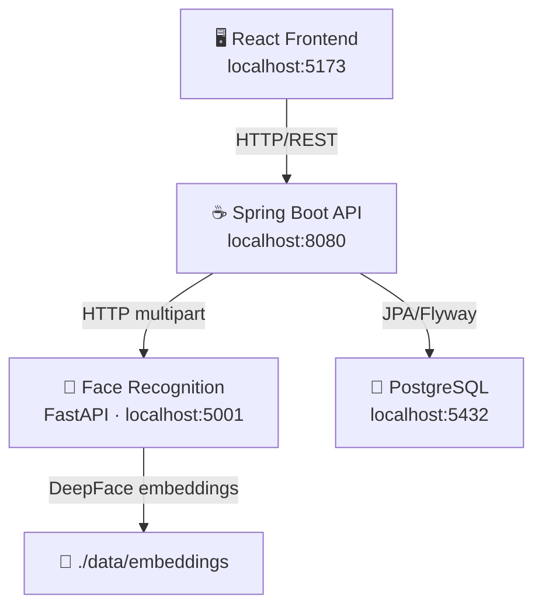

# BundyClock — Time Attendance Web App System

A full-stack time in/out attendance system with face recognition, built as a modular monorepo.

---

## System Architecture



---

## Folder Structure

```
bundyclock/
├── backend/                         ← Spring Boot (Java 23, Gradle KTS)
│   ├── build.gradle.kts
│   ├── settings.gradle.kts
│   └── src/
│       ├── main/
│       │   ├── java/com/bundyclock/
│       │   │   ├── BundyClockApplication.java
│       │   │   ├── auth/
│       │   │   │   └── AuthController.java
│       │   │   ├── config/
│       │   │   │   ├── CorsConfig.java
│       │   │   │   ├── OpenApiConfig.java
│       │   │   │   └── SecurityConfig.java
│       │   │   ├── common/
│       │   │   │   ├── dto/
│       │   │   │   │   └── ApiResponse.java
│       │   │   │   └── exception/
│       │   │   │       ├── GlobalExceptionHandler.java
│       │   │   │       └── ResourceNotFoundException.java
│       │   │   └── domain/
│       │   │       ├── employee/
│       │   │       │   ├── Employee.java
│       │   │       │   ├── EmployeeController.java
│       │   │       │   ├── EmployeeRepository.java
│       │   │       │   ├── EmployeeService.java
│       │   │       │   └── EmployeeServiceImpl.java
│       │   │       ├── attendance/
│       │   │       │   ├── AttendanceLog.java
│       │   │       │   ├── AttendanceController.java
│       │   │       │   ├── AttendanceLogRepository.java
│       │   │       │   ├── AttendanceService.java
│       │   │       │   └── AttendanceServiceImpl.java
│       │   │       └── face/
│       │   │           ├── FaceEmbedding.java
│       │   │           ├── FaceController.java
│       │   │           ├── FaceEmbeddingRepository.java
│       │   │           ├── FaceService.java
│       │   │           ├── FaceServiceImpl.java
│       │   │           └── FaceVerifyResult.java
│       │   └── resources/
│       │       ├── application.yml
│       │       ├── application-dev.yml
│       │       └── db/migration/
│       │           └── V1__create_initial_tables.sql
│       └── test/
│           ├── java/.../BundyClockApplicationTests.java
│           └── resources/application.yml
│
├── frontend/                        ← React + Vite + MUI
│   ├── index.html
│   ├── package.json
│   ├── vite.config.js
│   └── src/
│       ├── main.jsx
│       ├── App.jsx
│       ├── context/
│       │   └── AppContext.jsx
│       ├── api/
│       │   ├── axiosClient.js
│       │   ├── auth.js
│       │   ├── employees.js
│       │   ├── attendance.js
│       │   └── face.js
│       ├── components/
│       │   ├── WebcamCapture.jsx
│       │   ├── EmployeeCard.jsx
│       │   └── NavigationBar.jsx
│       └── pages/
│           ├── Login.jsx
│           ├── EmployeeList.jsx
│           ├── EmployeeRegistration.jsx
│           ├── BundyClock.jsx
│           └── AttendanceLogs.jsx
│
├── face-recognition-service/        ← Python FastAPI + DeepFace
│   ├── run.py
│   ├── requirements.txt
│   ├── .env.example
│   ├── app/
│   │   ├── main.py
│   │   ├── core/
│   │   │   └── config.py
│   │   ├── routers/
│   │   │   └── face.py
│   │   ├── schemas/
│   │   │   └── face_schemas.py
│   │   └── services/
│   │       └── face_service.py
│   ├── data/
│   │   ├── faces/           ← raw face images
│   │   └── embeddings/      ← JSON embedding vectors
│   └── tests/
│       └── test_face_router.py
│
└── bundyclock-postman-collection.json
```

---

## Prerequisites

| Tool | Version | Notes |
|------|---------|-------|
| Java JDK | 23 | [Adoptium](https://adoptium.net) or [Oracle](https://oracle.com/java) |
| Gradle | 8.x | Bundled via wrapper (`./gradlew`) |
| PostgreSQL | 15+ | `brew install postgresql` / [psql](https://www.postgresql.org/download/windows/) |
| Node.js | 20 LTS | [nodejs.org](https://nodejs.org) |
| Python | 3.10 – 3.12 | [python.org](https://python.org) |
| Git | Any | — |

---

## 1 · Database Setup

```sql
-- Run once in psql or pgAdmin
CREATE DATABASE bundyclock_db;
CREATE DATABASE bundyclock_dev;
```

---

## 2 · Backend (Spring Boot)

```bash
cd backend

# Windows
.\gradlew.bat bootRun --args='--spring.profiles.active=dev'

# macOS / Linux
./gradlew bootRun --args='--spring.profiles.active=dev'
```

- API base URL: http://localhost:8080
- Swagger UI: http://localhost:8080/swagger-ui.html
- Flyway runs automatically and creates all tables on first start.

**Edit `src/main/resources/application.yml`** to adjust the DB credentials if needed.

---

## 3 · Frontend (React + Vite)

```bash
cd frontend
npm install
npm run dev
```

- App URL: http://localhost:5173
- Vite proxies `/api` → `http://localhost:8080`

---

## 4 · Face Recognition Service (Python FastAPI)

```bash
cd face-recognition-service

# Create a virtual environment (recommended)
python -m venv .venv

# Activate (Windows)
.venv\Scripts\activate

# Activate (macOS/Linux)
source .venv/bin/activate

# Install dependencies
pip install -r requirements.txt

# Copy and edit .env (optional)
copy .env.example .env     # Windows
cp .env.example .env       # macOS/Linux

# Start service
python run.py
```

- Service URL: http://localhost:5001
- API Docs: http://localhost:5001/docs
- Health check: http://localhost:5001/health

> **Note:** First launch downloads DeepFace model weights (~500 MB). Subsequent starts are fast.

---

## 5 · Running Everything Together (PowerShell)

Open **three separate terminals** and run:

```powershell
# Terminal 1 — Backend
cd C:\projects\2026\bundyclock\backend
.\gradlew.bat bootRun --args='--spring.profiles.active=dev'

# Terminal 2 — Frontend
cd C:\projects\2026\bundyclock\frontend
npm install; npm run dev

# Terminal 3 — Face Recognition Service
cd C:\projects\2026\bundyclock\face-recognition-service
.venv\Scripts\activate
python run.py
```

---

## 6 · Postman Collection

Import `bundyclock-postman-collection.json` in Postman.

Set collection variables:
| Variable | Value |
|----------|-------|
| `base_url` | `http://localhost:8080` |
| `face_url` | `http://localhost:5001` |
| `token` | *(auto-populated on login)* |
| `employee_id` | *(paste a real UUID after creating an employee)* |

---

## 7 · API Endpoints Summary

### Spring Boot (`:8080`)

| Method | Endpoint | Description |
|--------|----------|-------------|
| `POST` | `/api/auth/login` | Login (returns JWT stub) |
| `GET` | `/api/employees` | List all employees |
| `POST` | `/api/employees` | Create employee |
| `GET` | `/api/employees/{id}` | Get employee by ID |
| `PUT` | `/api/employees/{id}` | Update employee |
| `DELETE`| `/api/employees/{id}` | Delete employee |
| `POST` | `/api/attendance/time-in` | Record Time-In |
| `POST` | `/api/attendance/time-out` | Record Time-Out |
| `GET` | `/api/attendance` | All attendance logs |
| `POST` | `/api/face/verify` | Verify face (proxies to face-svc) |
| `POST` | `/api/face/register` | Register face (proxies to face-svc) |

### Face Recognition Service (`:5001`)

| Method | Endpoint | Description |
|--------|----------|-------------|
| `POST` | `/verify-face` | Verify face image |
| `POST` | `/register-face` | Register face for employee |
| `GET` | `/health` | Health check |

---

## 8 · Data Model Overview (ASCII)

```
┌──────────────┐        ┌───────────────────┐       ┌────────────────────┐
│   employees  │        │  attendance_logs  │       │  face_embeddings   │
├──────────────┤        ├───────────────────┤       ├────────────────────┤
│ id (UUID PK) │◄─┐     │ id (UUID PK)      │       │ id (UUID PK)       │
│ name         │  └────►│ employee_id (FK)  │  ┌───►│ employee_id (FK)   │
│ employee_code│        │ timestamp         │  │    │ embedding_vector   │
│ department   │        │ type (IN/OUT)     │  │    │ raw_image_path     │
│ email        │        │ image_path        │  │    │ model_used         │
│ created_at   │  ┌────►│ confidence_score  │  └────┤ created_at         │
│ updated_at   │  │     │ verified          │       └────────────────────┘
└──────────────┘  │     │ notes             │
                  │     └───────────────────┘
                  │
           (same FK pattern)
```

---

## 9 · Production Hardening Notes

### Security
- [ ] Replace placeholder JWT with real Spring Security JWT filter chain (`jjwt` or `nimbus-jose-jwt`)
- [ ] Add role-based access control (`ADMIN`, `EMPLOYEE`, `KIOSK` roles)
- [ ] Enable HTTPS (TLS) with Let's Encrypt or a reverse proxy (nginx/caddy)
- [ ] Secrets management via AWS Secrets Manager, Azure Key Vault, or Vault by HashiCorp
- [ ] Rate-limit `/api/auth/login` with `bucket4j` or nginx

### Database
- [ ] Move from IDENTITY/UUID to a proper surrogate key strategy
- [ ] Consider `pgvector` extension for storing face embedding vectors natively with similarity search
- [ ] Add DB connection pooling (HikariCP — already included by Spring Boot)
- [ ] Set up read replicas for attendance log queries

### Face Recognition
- [ ] Switch to `ArcFace` model (more accurate than VGG-Face) in production
- [ ] Use `retinaface` detector for better face detection in varied lighting
- [ ] Implement liveness detection (anti-spoofing) to prevent photo attacks
- [ ] Store embeddings in PostgreSQL `pgvector` instead of flat JSON files
- [ ] Add confidence threshold tuning per environment

### Frontend
- [ ] Add React Query or SWR for server state management and caching
- [ ] Implement proper error boundaries
- [ ] Add PWA manifest for kiosk deployment
- [ ] Consider migrating to TypeScript

### Infrastructure
- [ ] Dockerize all three services (Dockerfile + docker-compose.yml)
- [ ] Set up CI/CD pipeline (GitHub Actions)
- [ ] Add structured logging (Logback JSON appender → ELK / Loki)
- [ ] Implement distributed tracing (OpenTelemetry)

---

## 10 · Known MVP Limitations

1. JWT authentication returns a **stub token** — not validated by the backend.
2. Face recognition in `FaceServiceImpl.java` is **not yet wired** to the Python service HTTP client.
3. Image storage is **local filesystem** — will not work in stateless/containerized environments.
4. No pagination on list endpoints.
5. Face embeddings comparison is O(n) linear scan — use `pgvector` for scale.
# bundyClock_withFacialRecog
