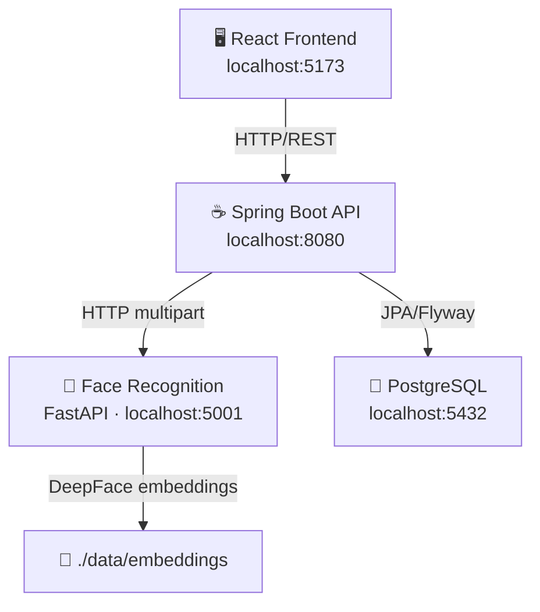

# BundyClock — Time Attendance Web App System

A full-stack time in/out attendance system with face recognition, built as a modular monorepo.

---

## System Architecture


```mermaid
graph TD
    Browser["🖥️ React Frontend<br/>localhost:5173"]
    Backend["☕ Spring Boot API<br/>localhost:8080"]
    FaceService["🐍 Face Recognition<br/>FastAPI · localhost:5001"]
    DB["🐘 PostgreSQL<br/>localhost:5432"]

    Browser --> |HTTP/REST| Backend
    Backend --> |JPA/Flyway| DB
    Backend --> |HTTP multipart| FaceService
    FaceService --> |DeepFace embeddings| FaceStorage["📁 ./data/embeddings"]
```

---

## Folder Structure

```
bundyclock/
├── backend/                         ← Spring Boot (Java 23, Gradle KTS)
│   ├── build.gradle.kts
│   ├── settings.gradle.kts
│   └── src/
│       ├── main/
│       │   ├── java/com/bundyclock/
│       │   │   ├── BundyClockApplication.java
│       │   │   ├── auth/
│       │   │   │   └── AuthController.java
│       │   │   ├── config/
│       │   │   │   ├── AppConfig.java          ← RestTemplate bean
│       │   │   │   ├── CorsConfig.java         ← PATCH added to allowed methods
│       │   │   │   ├── OpenApiConfig.java
│       │   │   │   ├── SecurityConfig.java
│       │   │   │   └── WebMvcConfig.java       ← serves /uploads/** static files
│       │   │   ├── common/
│       │   │   │   ├── dto/
│       │   │   │   │   └── ApiResponse.java
│       │   │   │   └── exception/
│       │   │   │       ├── GlobalExceptionHandler.java
│       │   │   │       └── ResourceNotFoundException.java
│       │   │   └── domain/
│       │   │       ├── employee/
│       │   │       │   ├── Employee.java
│       │   │       │   ├── EmployeeController.java
│       │   │       │   ├── EmployeeRepository.java
│       │   │       │   ├── EmployeeService.java
│       │   │       │   └── EmployeeServiceImpl.java
│       │   │       ├── attendance/
│       │   │       │   ├── AttendanceLog.java
│       │   │       │   ├── AttendanceController.java
│       │   │       │   ├── AttendanceLogRepository.java
│       │   │       │   ├── AttendanceService.java
│       │   │       │   └── AttendanceServiceImpl.java ← duplicate guard
│       │   │       └── face/
│       │   │           ├── FaceEmbedding.java
│       │   │           ├── FaceController.java
│       │   │           ├── FaceEmbeddingRepository.java
│       │   │           ├── FaceService.java
│       │   │           ├── FaceServiceImpl.java        ← real HTTP calls
│       │   │           └── FaceVerifyResult.java
│       │   └── resources/
│       │       ├── application.yml
│       │       ├── application-dev.yml
│       │       └── db/migration/
│       │           └── V1__create_initial_tables.sql
│       └── test/
│           ├── java/.../BundyClockApplicationTests.java
│           └── resources/application.yml               ← H2 + app props
│
├── frontend/                        ← React + Vite + MUI
│   ├── index.html
│   ├── package.json
│   ├── vite.config.js
│   └── src/
│       ├── main.jsx
│       ├── App.jsx
│       ├── context/
│       │   └── AppContext.jsx
│       ├── api/
│       │   ├── axiosClient.js      ← 15s default / 120s for face calls
│       │   ├── auth.js
│       │   ├── employees.js
│       │   ├── attendance.js
│       │   └── face.js
│       ├── components/
│       │   ├── WebcamCapture.jsx   ← autoCapture countdown mode
│       │   ├── EmployeeCard.jsx    ← Register Face button
│       │   └── NavigationBar.jsx
│       └── pages/
│           ├── Login.jsx
│           ├── EmployeeList.jsx
│           ├── EmployeeRegistration.jsx
│           ├── EmployeeProfile.jsx         ← new: view/edit profile + upload photo
│           ├── BundyClock.jsx              ← auto face scan; freezes camera after success
│           ├── FaceRegistration.jsx        ← auto-stops after first capture; sets profile photo
│           └── AttendanceLogs.jsx
│
├── face-recognition-service/        ← Python FastAPI + DeepFace
│   ├── run.py
│   ├── requirements.txt
│   ├── app/
│   │   ├── main.py
│   │   ├── core/
│   │   │   └── config.py
│   │   ├── routers/
│   │   │   └── face.py
│   │   ├── schemas/
│   │   │   └── face_schemas.py
│   │   └── services/
│   │       └── face_service.py     ← multi-embedding accumulation
│   ├── data/
│   │   ├── faces/           ← raw face images
│   │   └── embeddings/      ← JSON embedding vectors (one file per employee)
│   └── tests/
│       ├── test_face_router.py   ← router-level tests (all service calls mocked)
│       └── test_face_service.py ← service unit tests (disk I/O + DeepFace mocked)
│
└── bundyclock-postman-collection.json
└── CHANGELOG.md
```

---

## Prerequisites

| Tool | Version | Notes |
|------|---------|-------|
| Java JDK | 23 | [Adoptium](https://adoptium.net) or [Oracle](https://oracle.com/java) |
| Gradle | 8.x | Bundled via wrapper (`./gradlew`) |
| PostgreSQL | 15+ | [psql](https://www.postgresql.org/download/windows/) |
| Node.js | 20 LTS | [nodejs.org](https://nodejs.org) |
| Python | 3.10 – 3.12 | [python.org](https://python.org) |
| Git Bash | Any | Recommended terminal on Windows |

---

## 1 · Database Setup

```sql
-- Run once in psql or pgAdmin
CREATE DATABASE bundyclock_db;
CREATE DATABASE bundyclock_dev;
```

---

## 2 · Backend (Spring Boot)

```bash
cd backend

# Git Bash (Windows) / macOS / Linux
./gradlew bootRun --args='--spring.profiles.active=dev'
```

- API base URL: http://localhost:8080
- Swagger UI: http://localhost:8080/swagger-ui.html
- Flyway runs automatically and creates all tables on first start.

**Edit `src/main/resources/application.yml`** to adjust the DB credentials if needed.

---

## 3 · Frontend (React + Vite)

```bash
cd frontend
npm install
npm run dev
```

- App URL: http://localhost:5173
- Vite proxies `/api` → `http://localhost:8080`

---

## 4 · Face Recognition Service (Python FastAPI)

```bash
cd face-recognition-service

# Create a virtual environment (first time only)
python -m venv .venv

# Activate — Git Bash / macOS / Linux
source .venv/Scripts/activate   # Git Bash on Windows
source .venv/bin/activate        # macOS / Linux

# Install dependencies (first time only)
pip install -r requirements.txt

# Start service
python run.py
```

- Service URL: http://localhost:5001
- API Docs: http://localhost:5001/docs
- Health check: http://localhost:5001/health

> **Note:** First launch downloads the VGG-Face model weights (~580 MB) to `~/.deepface/weights/`. Subsequent starts are fast.

> **Dependency note:** TensorFlow 2.20+ requires the `tf-keras` package. It is included in `requirements.txt`.

---

## 5 · Running Everything Together (Git Bash)

Open **three separate terminals** and run:

```bash
# Terminal 1 — Backend
cd /c/projects/2026/bundyclock/backend
./gradlew bootRun --args='--spring.profiles.active=dev'

# Terminal 2 — Frontend
cd /c/projects/2026/bundyclock/frontend
npm install && npm run dev

# Terminal 3 — Face Recognition Service
cd /c/projects/2026/bundyclock/face-recognition-service
source .venv/Scripts/activate
python run.py
```

### Stopping & restarting (Git Bash)

```bash
# Kill processes on all service ports
for port in 8080 5001 5173; do
  PID=$(netstat -ano | grep "LISTENING" | grep ":${port} " | awk '{print $NF}' | head -1)
  [ -n "$PID" ] && taskkill.exe //F //PID $PID
done
```

---

## 6 · Unit Testing

### 6a · Backend (Spring Boot — JUnit 5 + MockMvc)

#### Overview

Controller-layer tests use `@WebMvcTest` + Mockito mocks. No database or external services are required.

| Test class | Endpoints covered | Tests |
|---|---|---|
| `EmployeeControllerTest` | `GET/POST/PUT/DELETE /api/employees`, `PATCH /{id}/photo` | 12 |
| `AttendanceControllerTest` | `POST time-in/out`, `GET /api/attendance` | 8 |
| `FaceControllerTest` | `POST /api/face/verify` + `/register` | 6 |
| `AuthControllerTest` | `POST /api/auth/login` | 3 |

#### Running backend tests

```bash
cd backend

# All tests
./gradlew test

# Specific controller
./gradlew test --tests "com.bundyclock.domain.employee.EmployeeControllerTest"

# Skip up-to-date cache and re-run
./gradlew cleanTest test

# View HTML report
start build/reports/tests/test/index.html
```

#### Test application config (`src/test/resources/application.yml`)

Tests use an **in-memory H2** database — no PostgreSQL connection required:

```yaml
spring:
  datasource:
    url: jdbc:h2:mem:testdb;DB_CLOSE_DELAY=-1;MODE=PostgreSQL
    driver-class-name: org.h2.Driver
  jpa:
    hibernate:
      ddl-auto: create-drop
  flyway:
    enabled: false
```

#### Test design notes

- `@WebMvcTest` — loads only the web layer (no JPA, no real beans).
- `@Import(SecurityConfig.class)` — CSRF disabled, all requests permitted.
- `@WithMockUser` — satisfies Spring Security principal requirement.
- `@MockBean` — replaces service with Mockito stub.
- `MockMultipartFile` — simulates multipart uploads (including photo PATCH).
- Error paths (404, 409, 400) covered by stubbing exceptions → `GlobalExceptionHandler`.

---

### 6b · Frontend (React — Vitest + Testing Library)

#### Overview

Component and API module tests run in JSDOM via **Vitest**. No real browser or server is needed.

| Test file | What is tested |
|---|---|
| `src/api/employees.test.js` | All 6 API functions — correct endpoint, method, payload; multipart boundary not overridden |
| `src/components/WebcamCapture.test.jsx` | Rendering, countdown behaviour, autoCapture toggling, error/success state captions |
| `src/pages/BundyClock.test.jsx` | Initial render, mode toggle, employee load, clock display |

#### Running frontend tests

```bash
cd frontend

# Install dependencies (first time)
npm install

# Run all tests once
npm test

# Watch mode (re-runs on file save)
npm run test:watch

# With coverage report
npm run test:coverage
# Coverage HTML: frontend/coverage/index.html
```

#### Adding new tests

1. Create `*.test.jsx` / `*.test.js` next to the file under test.
2. Mock external modules with `vi.mock('../path/to/module')`.
3. Mock `react-webcam` so tests run without camera hardware:
   ```js
   vi.mock('react-webcam', () => ({ default: vi.fn(() => <video />) }))
   ```
4. Use `vi.useFakeTimers()` / `vi.advanceTimersByTime()` to test countdown logic.

---

### 6c · Python Face Service (pytest)

#### Overview

Two test modules cover the FastAPI router and the service layer independently.

| Test file | What is tested |
|---|---|
| `tests/test_face_router.py` | All HTTP endpoints — validation (422), content-type guard (400), success / failure paths, accumulation, 500 on exception |
| `tests/test_face_service.py` | `_cosine_similarity`, `register_face` (success, no-face, accumulation), `verify_face` (match, no-match, threshold, best-of-multiple) |

#### Running Python tests

```bash
cd face-recognition-service
source .venv/Scripts/activate   # Windows Git Bash
source .venv/bin/activate        # macOS / Linux

# All tests with verbose output
pytest tests/ -v

# Run a single file
pytest tests/test_face_router.py -v

# With coverage
pip install pytest-cov
pytest tests/ --cov=app --cov-report=term-missing
```

#### Test design notes

- `patch("app.routers.face.face_service.verify_face")` — patches at the import location, not the definition location.
- `monkeypatch.setattr("app.core.config.settings.EMBEDDINGS_DIR", ...)` — redirects disk reads/writes to `tmp_path` pytest fixtures.
- `DUMMY_IMAGE = b"\xff\xd8..."` — JPEG magic bytes that pass the content-type guard without needing a real image.
- No DeepFace model weights are downloaded during test runs.

---

## 7 · Face Registration Workflow

Before employees can use the BundyClock, their face must be registered:

1. Go to **Employees** → find the employee → click **Register Face**
2. The webcam opens with a **3-second countdown** — position the employee's face in the frame
3. The photo is automatically captured and sent to the face service
4. Register **2–5 photos** from slightly different angles for best accuracy
5. Each photo is accumulated (not overwritten) — all registered embeddings are used during verification

---

## 8 · BundyClock Face Scan Workflow

1. Go to **BundyClock** and select **Time In** or **Time Out**
2. Position your face in the frame — a **3-second countdown** fires the auto-capture
3. The system verifies the face against all registered embeddings
4. On **success**: attendance is recorded; the camera freezes on the captured frame; the completed toggle button (Time In or Time Out) is disabled to prevent double-recording; a **Scan Again** button appears
5. On **face-not-recognised error**: the error message shows for 3 seconds then the countdown restarts automatically so the next person can try
6. On **attendance API error** (e.g. duplicate 409): auto-capture stops immediately — the error stays visible and **Scan Again** must be clicked manually
7. Clicking **Scan Again** resets the camera, re-enables both toggles, and restarts the countdown

### Business Rules enforced by the backend

| Condition | Result |
|-----------|--------|
| Employee already timed in today and tries to time in again | `409` — "Already timed in today. Please time out first." |
| Employee tries to time out with no time-in record today | `409` — "Cannot time out — no time-in record found for today." |
| Employee already timed out today and tries again | `409` — "Already timed out today." |

---

## 9 · Postman Collection

Import `bundyclock-postman-collection.json` in Postman.

Set collection variables:
| Variable | Value |
|----------|-------|
| `base_url` | `http://localhost:8080` |
| `face_url` | `http://localhost:5001` |
| `token` | *(auto-populated on login)* |
| `employee_id` | *(paste a real UUID after creating an employee)* |

---

## 10 · Test Accounts & Sample Data

Use these credentials and sample employee profiles to explore the system without setting up real data.

### Admin Login

| Field | Value |
|-------|-------|
| Username | `admin` |
| Password | `admin123` |

> The admin account is used for the `/api/auth/login` endpoint. It returns a stub JWT token that is accepted by all secured endpoints.

---

### Sample Employee Profiles

These employee records can be created via `POST /api/employees` (or imported through the Postman collection) to simulate a realistic workforce for testing attendance, face registration, and BundyClock flows.

| # | Name | Employee Code | Department | Email |
|---|------|---------------|------------|-------|
| 1 | **Maria Santos** | `EMP-001` | Engineering | maria.santos@bundyclock.local |
| 2 | **James Rivera** | `EMP-002` | Human Resources | james.rivera@bundyclock.local |
| 3 | **Ana Reyes** | `EMP-003` | Finance | ana.reyes@bundyclock.local |
| 4 | **Carlo Mendoza** | `EMP-004` | Operations | carlo.mendoza@bundyclock.local |
| 5 | **Sofia Torres** | `EMP-005` | Engineering | sofia.torres@bundyclock.local |
| 6 | **Miguel Dela Cruz** | `EMP-006` | Sales | miguel.delacruz@bundyclock.local |
| 7 | **Lena Villanueva** | `EMP-007` | IT Support | lena.villanueva@bundyclock.local |
| 8 | **Ramon Castillo** | `EMP-008` | Operations | ramon.castillo@bundyclock.local |

---

### Quick Seed via Postman

1. Log in with the admin credentials above to get the stub token.
2. In the Postman collection, open the **Employees → Create Employee** request.
3. Copy-paste a sample profile from the table above into the request body:

```json
{
  "name": "Maria Santos",
  "employeeCode": "EMP-001",
  "department": "Engineering",
  "email": "maria.santos@bundyclock.local"
}
```

4. Repeat for each employee you want to seed.
5. After creating employees, use **Face Registration** (Register Face button on the Employee List page) to register their faces before testing the BundyClock flow.

---

### Testing Scenarios

| Scenario | Steps |
|----------|-------|
| Happy path — Time In | Select **Time In**, show a registered face, confirm attendance logged |
| Happy path — Time Out | After timing in, select **Time Out**, show same face |
| Duplicate Time In | Attempt **Time In** twice in the same day → expect `409` error |
| Unknown face | Show an unregistered face → verification fails gracefully |
| Admin login | POST `{"username":"admin","password":"admin123"}` to `/api/auth/login` |
| View logs | Open **Attendance Logs** page, filter by employee or date |

---

## 11 · API Endpoints Summary

### Spring Boot (`:8080`)

| Method | Endpoint | Description |
|--------|----------|-------------|
| `POST` | `/api/auth/login` | Login (returns JWT stub) |
| `GET` | `/api/employees` | List all employees |
| `POST` | `/api/employees` | Create employee |
| `GET` | `/api/employees/{id}` | Get employee by ID |
| `PUT` | `/api/employees/{id}` | Update employee |
| `PATCH` | `/api/employees/{id}/photo` | Upload / replace employee profile photo |
| `DELETE`| `/api/employees/{id}` | Delete employee |
| `POST` | `/api/attendance/time-in` | Record Time-In (with duplicate guard) |
| `POST` | `/api/attendance/time-out` | Record Time-Out (with duplicate guard) |
| `GET` | `/api/attendance` | All attendance logs |
| `GET` | `/api/attendance/employee/{id}` | Logs for one employee |
| `POST` | `/api/face/verify` | Verify face (proxies to face-svc) |
| `POST` | `/api/face/register` | Register face (proxies to face-svc) |

### Face Recognition Service (`:5001`)

| Method | Endpoint | Description |
|--------|----------|-------------|
| `POST` | `/verify-face` | Verify face image against all stored embeddings |
| `POST` | `/register-face` | Register/accumulate face embedding for employee |
| `GET` | `/health` | Health check |

---

## 12 · Data Model Overview

```
┌──────────────┐        ┌───────────────────┐       ┌────────────────────┐
│   employees  │        │  attendance_logs  │       │  face_embeddings   │
├──────────────┤        ├───────────────────┤       ├────────────────────┤
│ id (UUID PK) │◄─┐     │ id (UUID PK)      │       │ id (UUID PK)       │
│ name         │  └────►│ employee_id (FK)  │  ┌───►│ employee_id (FK)   │
│ employee_code│        │ timestamp         │  │    │ raw_image_path     │
│ department   │        │ type (IN/OUT)     │  │    │ model_used         │
│ email        │        │ image_path        │  │    │ created_at         │
│ photo_url    │  ┌────►│ confidence_score  │  └────┤                    │
│ created_at   │  │     │ verified          │       └────────────────────┘
│ updated_at   │  │     │ notes             │
                  │     └───────────────────┘
                  │
           (same FK pattern)

Embeddings on disk (face-recognition-service/data/embeddings/):
  {employee_id}.json → { "employee_id": "...", "embeddings": [[...], [...]] }
  Multiple photos per employee are accumulated — not overwritten.
```

---

## 13 · Production Hardening Notes

### Security
- [ ] Replace placeholder JWT with real Spring Security JWT filter chain (`jjwt` or `nimbus-jose-jwt`)
- [ ] Add role-based access control (`ADMIN`, `EMPLOYEE`, `KIOSK` roles)
- [ ] Enable HTTPS (TLS) with Let's Encrypt or a reverse proxy (nginx/caddy)
- [ ] Secrets management via AWS Secrets Manager, Azure Key Vault, or Vault by HashiCorp
- [ ] Rate-limit `/api/auth/login` with `bucket4j` or nginx

### Database
- [ ] Consider `pgvector` extension for storing face embedding vectors natively with similarity search
- [ ] Add DB connection pooling (HikariCP — already included by Spring Boot)
- [ ] Set up read replicas for attendance log queries

### Face Recognition
- [ ] Switch to `ArcFace` model (more accurate than VGG-Face) in production
- [ ] Use `retinaface` detector for better face detection in varied lighting
- [ ] Implement liveness detection (anti-spoofing) to prevent photo attacks
- [ ] Store embeddings in PostgreSQL `pgvector` instead of flat JSON files
- [ ] Add confidence threshold tuning per environment

### Frontend
- [ ] Add React Query or SWR for server state management and caching
- [ ] Implement proper error boundaries
- [ ] Add PWA manifest for kiosk deployment
- [ ] Consider migrating to TypeScript

### Infrastructure
- [ ] Dockerize all three services (Dockerfile + docker-compose.yml)
- [ ] Set up CI/CD pipeline (GitHub Actions)
- [ ] Add structured logging (Logback JSON appender → ELK / Loki)
- [ ] Implement distributed tracing (OpenTelemetry)

---

## 14 · Known MVP Limitations

1. JWT authentication returns a **stub token** — not validated by the backend.
2. Image storage is **local filesystem** — will not work in stateless/containerised environments without a volume or object store.
3. No pagination on list endpoints.
4. Face embeddings comparison is O(n × k) linear scan — use `pgvector` for scale.
5. DeepFace model weights (~580 MB) are downloaded on first run; ensure internet access on first start.
